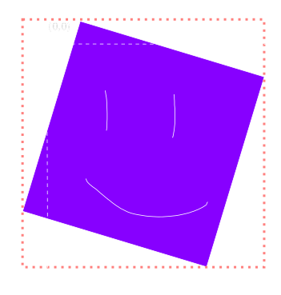
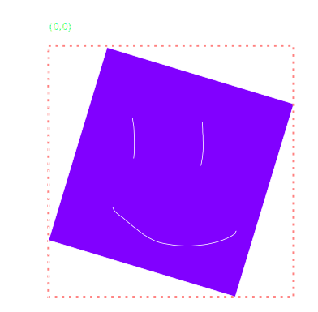

<!-- theme: sjaakvandenberg/cleaver-light -->
<!--theme: jdan/cleaver-retro-->
theme: cleaver-light

---
#Making games in python

##Frans skarman
##2016

---

###Components of a game


- Input

- Graphics


- Sounds


- High scores

- Networking


---

###Libraries

- Pygame (What I will show you)

- PySFML (unmaintained)

- PySDL2

- Cocos2D

- Panda3D


---

###Pygame

Install the library
``` Bash
> pip3 install pygame
```

Import it in your project
```python
import pygame

def main():
	pygame.init()

	WINDOW_SIZE = (1024, 768)
	screen = pygame.display.set_mode(WINDOW_SIZE)

main()
```


---
#Events

---
###Events
```python


for event in pygame.event.get():
	if event.type == pygame.QUIT:
		#The user wants to close the window
```

---
###Events

```python
running = True #True as long as the game should be running
while running:
	for event in pygame.event.get():
		if event.type == pygame.QUIT:
			running = False
```


---

#Graphcs


---
###Draw images
Load an image
```python
image = pygame.image.load("path/to/image")
```

Drawing the image to our window
```python
screen.blit(image, (0,0))
```
---
###In our code
```python
image = pygame.image.load("resources/ghost.png")

running = True
while running:
	screen.blit(image, (0,0))

...
```


---
###Showing what we drew
Drawing is done to a buffer.

In order to send that buffer to the screen, we use this:

```python
pygame.display.flip()
```

---


###Changing the image
####Position is changed by the `blit` function
```python
screen.blit(image, (x, y))
```

####Scale and rotation with `pygame.transform`

Scale
```python
new_resolution = (width, height)
new_image = pygame.transform.scale(original, new_resolution)
```

Rotation
```python
new_image = pygame.transform.rotate(original, new_angle)
```


---

###Continuous movement
```python
position = 0
running = False
while running:
	position += 0.1
	screen.blit(image, (position,100))
	...
```

---

###Easiest way to refresh the sceeen
Redraw the background each frame

```python
background = pygame.image.load("resources/background.png")

#...

while True:
	image.blit(background, (0,0))

	draw_rest_of_game()
	...
```


---

###Rotation och pygame
Same code as position but for rotation
```python
angle = 0
running = False
while running:
	#Rotate and draw the image
	rotated = pygame.transform.rotate(image, angle)
	screen.blit(rotated, (100,100))

	angle += 0.1 #Increase angle
	...
```


---

###Rotation and pygame
We want to rotate this image


---

###Rotation and pygame
Pygame wants a new image




---
###Rotation and pygame
Negative pixels are not allowed



---

###Rotation and pygame
Original image


---
###Rotation around center

```python
def draw_translated_image(image, screen, position, scale, rotation):
    #Apply the rotation and scale we want
    scaled = pygame.transform.scale(image, scale)
    rotated = pygame.transform.rotate(scaled, rotation)

    #Calculate the center of the image
    (offset_x, offset_y) = (rotated.get_width() / 2, rotated.get_height() / 2)

    screen.blit(rotated, (position[0] - offset_x, position[1] - offset_y))
```


---
#Input

---

###Events, again
Some events we can listen for. More events in [documentation](http://www.pygame.org/docs/ref/event.html)
```
| Type            | Data              |
|-----------------+-------------------|
| QUIT            | none              |
| KEYDOWN         | unicode, key, mod |
| KEYUP           | key, mod          |
| MOUSEMOTION     | pos, rel, buttons |
| MOUSEBUTTONUP   | pos, button       |
| MOUSEBUTTONDOWN | pos, button       |
| JOYAXISMOTION   | joy, axis, value  |
| JOYBALLMOTION   | joy, ball, rel    |
```

Getting the data
```python
#Check the event
if event.type == pygame.KEYDOWN
	#use event.<data> to get the data
	print(event.key)
```


---
###Keyboard input
To avoid having to use numbers, use the constants found at http://www.pygame.org/docs/ref/key.html

Moving our sprite with the keyboard
```python
#Same code as we had before
if event.type == pygame.KEYDOWN:
	if event.key == pygame.K_RIGHT:
		position += 1
	elif event.key == pygame.K_LEFT:
		position -= 1
```


---
###Continuous movement
Pygame sends events for key presses and releases. We want 'keys held'

```python
#Create a dictionary to hold the current keys
keys_pressed = {}

#Main game loop
    while running:
		#Graphics stuff

        if pygame.K_LEFT in keys_pressed:
            position -= 1
        elif pygame.K_RIGHT in keys_pressed:
            position += 1

        #Loop through the list of events
        for event in pygame.event.get():
            #If the event tells us that the user has tried to close the window
            if event.type == pygame.KEYDOWN:
                keys_pressed[event.key] = True
            elif event.type == pygame.KEYUP:
                if event.key in keys_pressed:
                    del keys_pressed[event.key]

```


---

#Code structure

---

###Split into functions

```python

def main():
	init()

	while running:
		do_game_logic(...)

		draw_game(...)

		handle_input(...)
```


---

###Passing around data
```python
while running:
	#This isn't viable
	do_game_logic(player_pos, enemies, bullets, score, ...)

	draw_game(player_pos, enemies, bullets, score, screen, player_image, enemy_image, ...)
```

We need a better way of storing and passing our data around

```python
assets = load_assets()
game_state = init()
while running:
	do_game_logic(game_state)

	draw_game(game_state, assets)
	...
```

---


###A decent solution


Store the data in a dictionary
```python
game_state = {
	"player_pos": (100, 100),
	"player_health": 100,

	"enemy_positions": [(200, 300), (100, 50)],
	"enemy_health": [50, 75],
	"enemy_velocity": [(5,0), (3,0)]
	...
}
```

One problem:
```python
def remove_enemy(game_state, index):
	game_state["enemy_positions"].remove(index)
	game_state["enemy_health"].remove(index)
	game_state["enemy_velocity"].remove(index)
	...
	#What happens if we add more data?
```


---
###A better solution:

```python
game_state = {
	"player": {
		"position": (100, 100),
		"health": 100
	},

	"enemies": [
		{
			"position": (300, 200),
			"velocity": (5, 0),
			"health": 50
		}
		...
	]
}
```

Addition and removal now looks like this
```python
def add_enemy(game_state, position, velocity, health):
	game_state["enemies"].append({"position": position, "health": health, "velocity": velocity})


def remove_enemy(game_state, index):
	game_state["enemies"].remove(index)
```


